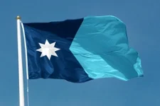
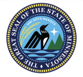
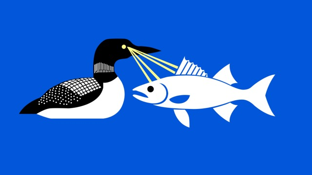
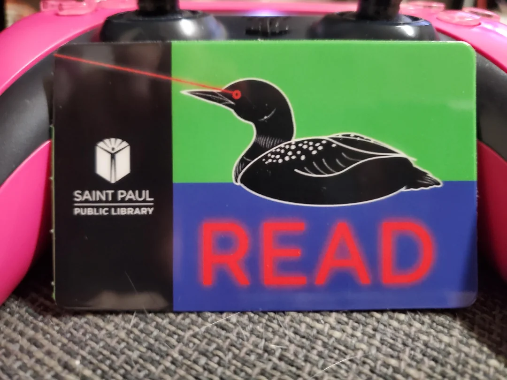
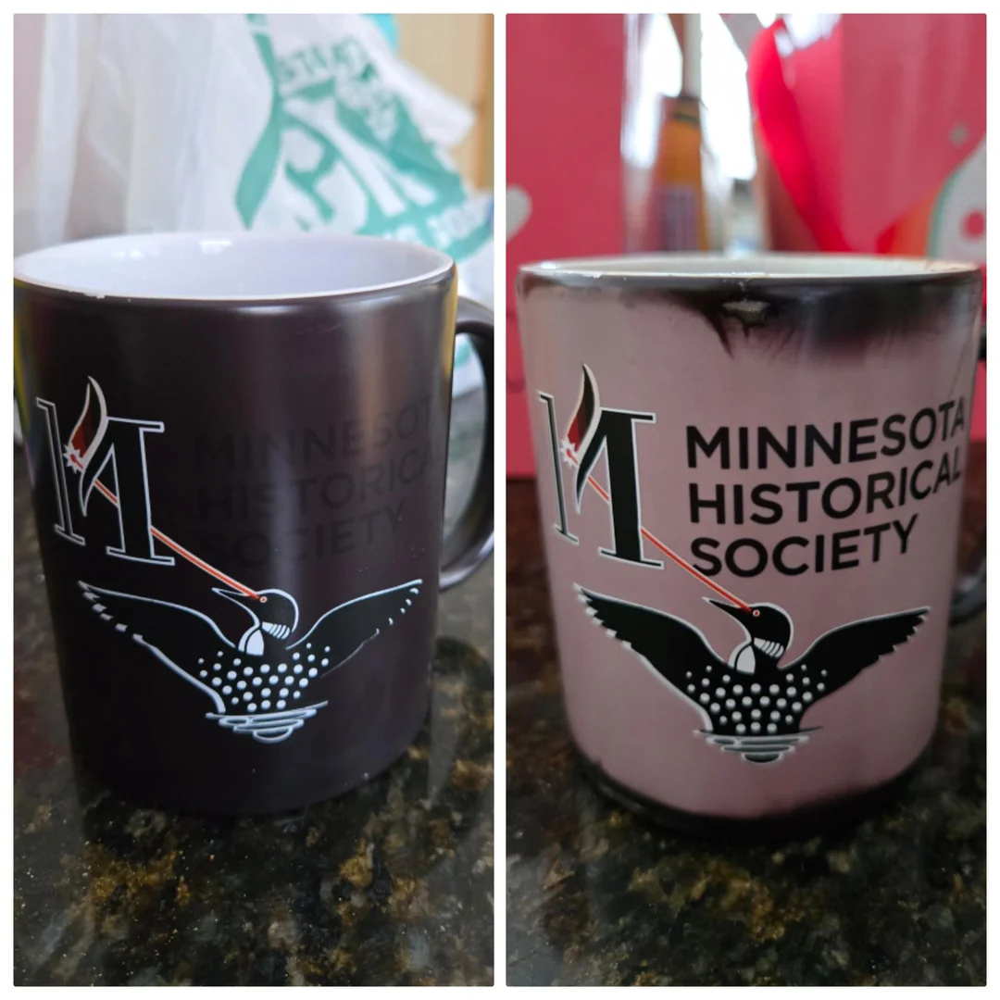
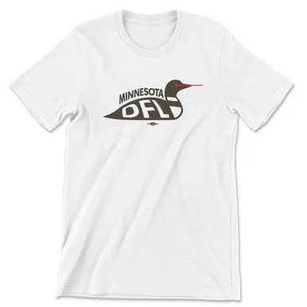
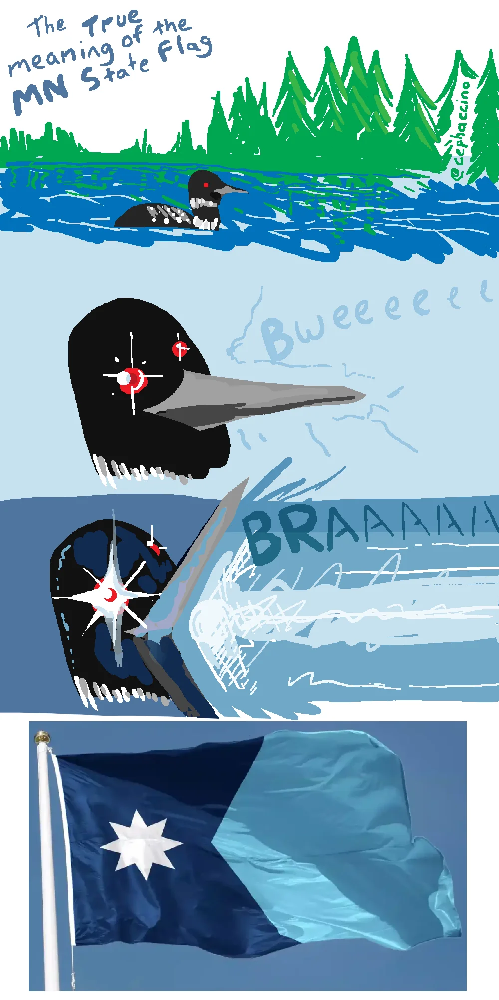
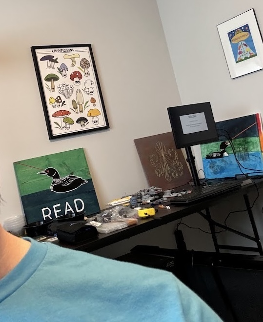

+++
title = "Flags, Birds, and Lasers"
date = 2025-03-19
+++

I live in Minnesota. I was born here, and while I have lived elsewhere in the US, more than 50% of my life has been here. But this isn't about me. This is about flags and loons and lasers.

The historical Minnesota state flag was not good. It was the state seal slapped in the middle of a big blue rectangle. The state seal was _problematic_ to say the least, in it's cartoonish depiction of native Americans and early settlers. There was even [a scathing video put out by CGP Grey](https://youtu.be/l4w6808wJcU) declaring it the worst state flag. I didn't disagree.

Before I go further, it's worth mentioning a few things about Minnesota; We have a lot of lakes. As a result, we have a lot of fishing, and one of the most prized/sought after fish is the [Walleye](https://en.wikipedia.org/wiki/Walleye). The state bird of Minnesota is the [Common Loon](https://en.wikipedia.org/wiki/Loon).

Okay, I think that about covers the "need to know" bits...

In 2023, the Minnesota state legislature ran a [public submissions contest](https://www3.mnhs.org/serc) to redesign the state seal as well as the state flag. Submissions ranged wildly across the spectrum, as you might imagine when you open anything up to the public at large.

The actual winners of the contest are _fine_. Certainly far better than the predecessors.

But the real joyous outcome of the contest wasn't the winners. It was the other submissions.

The most glorious of these was this; the laser loon.

It's got a walleye. It's got a loon. It's got... laser eyes? It's a perfect encapsulation of all things Minnesota.

The submission took a life of it's own, and other variants of laser loons also made their way into the contest. And while the laser loon design ultimately did not become the state flag, it did live on in other places. 

The St. Paul public library issued some limited edition library cards featuring a laser loon commanding you to read.

Sadly, I don't live in St. Paul so I didn't pick one up, but I'm happy they exist out there in the world.

The Minnesota Historical Society has mugs that feature our laser eyed mascot.

The Minnesota DFL (Democratic party) sold Laser Loon merch

There was a fair bit of disappointment when the state commission didn't pick the laser loon as the official state flag, but my friend made [this comic](https://www.reddit.com/r/minnesota/comments/18mby5y/the_symbolism_of_the_new_mn_state_flag_is_deeply/) to explain that ... no, in fact the state flag _is_ an abstract laser loon. 😂

On a more personal note, I made a couple of paintings of the library card loon, which now sit in my office.

I didn't see a very good start-to-finish explainer about the laser loons online, so I figured I'd write this up. Now you know.

As a bonus, here's a few links to laser loon related Reddit posts, some of which contributed to this writeup.

- [r/funny/comments/1aqd91y/i_got_a_library_card_today_the_one_i_was_given](https://www.reddit.com/r/funny/comments/1aqd91y/i_got_a_library_card_today_the_one_i_was_given/)
- [r/publicdomain/comments/1aq6c0j/laser_loon_mn_flag_public_domain](https://www.reddit.com/r/publicdomain/comments/1aq6c0j/laser_loon_mn_flag_public_domain/)
- [r/minnesota/comments/1iq3fzs/laser_loon_rides_again](https://www.reddit.com/r/minnesota/comments/1iq3fzs/laser_loon_rides_again/)
- [r/minnesota/comments/16z76y9/my_submission_for_new_state_flag](https://www.reddit.com/r/minnesota/comments/16z76y9/my_submission_for_new_state_flag/)
- [r/minnesota/comments/1i8ogfw/inspired_by_a_meme_and_the_beloved_laser_loon_3](https://www.reddit.com/r/minnesota/comments/1i8ogfw/inspired_by_a_meme_and_the_beloved_laser_loon_3/)
- [r/minnesota/comments/170myel/i_was_inspired_by_the_recent_flag_idea_post_by](https://www.reddit.com/r/minnesota/comments/170myel/i_was_inspired_by_the_recent_flag_idea_post_by/)
