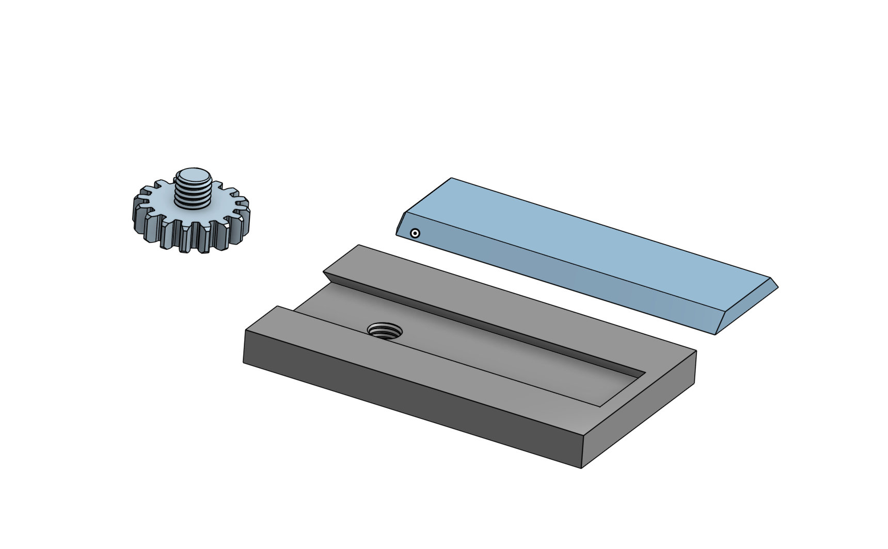
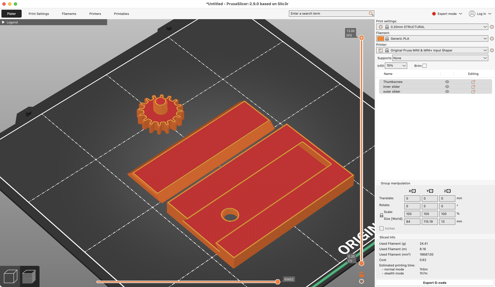
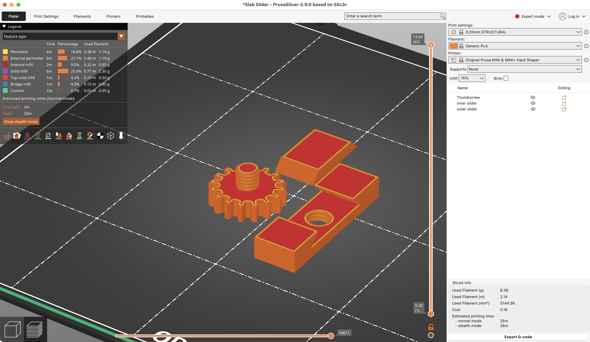

+++
title = "Rapid Prototyping with 3D printing"
date= 2025-01-26
+++

_Author's Note:_ Many folks reading this may not know or care about 3D printing, so I'll try to keep the technical jargon to a minimum.

I've been working on improving my CAD skills lately. I've had a 3D printer for a few years now, but for much of that time I mostly would just download other people's 3D models from various sites and print them. My ability to _imagine_ a thing in my mind and then just make it into a physical thing was quite limited by my inability to use _real_ CAD software.

I mostly used [TinkerCAD](https://tinkercad.com) for very simple designs. I could make a box. I could make a cylinder. I could make a sphere. I could combine those things in various ways, but it never really resulted in _slick_ looking designs, just minimally functional.

I'm now getting much better at using [Onshape](https://onshape.com) which is way more full featured, but also a way steeper learning curve.

Now is the time when I give a shout-out to Michael Laws for his Youtube series [3D Design for 3D Printing](https://www.youtube.com/playlist?list=PLGqRUdq5ULsONnjEEPeBxxStEsobDKAtV). Hugely helpful.

With the increased complexity of designs I'm able to accomplish, I'm learning the importance of "will this little mechanical part work?" -- hinges, screw holes, interlocking parts, and all the other exacting aspects of a functional thingie often require a cycle of printing the thing, testing it, and adjusting the model again. 3D models on a computer are very exact, but the strand of hot plastic goo that comes out of a 3D printer is nowhere near as exact.

The cycle of design -> print -> adjust design -> print can be quite time consuming. 3D prints can take many hours to complete depending on size, and it is quite frustrating to wait many hours for something to print only to find out that the measurements in your computer model don't work once they're printed in the really real world.

Fortunately, there's a trick one can do to make the adjust + printing cycle much faster. As an example, I'll use a project I'm working on right now, which involves a part that slides into a groove on another part, and a screw that will lock the slider in place.

I need to make sure the screw and the screw hole work well together. I also need to make sure the slider slab fits in the groove cut-out.

When 3D printing stuff, you load your 3D model into an app called a "slicer" which plots out the path that the printer will follow as it builds up your print out of many very thin layers (slices).

Here's an example of what that looks like:

Notice down in the corner it estimates that printing this stuff will take 67 minutes to print.

BUT, this is a slicer application! In addition to "slicing" your model into many horizontal layers, The slicer can also make arbitrary cuts in your model, allowing you to discard the parts that don't need testing. You can just print the portion of your model that needs testing!

So, in this case, we can just print a tiny portion of the full model which will allow me to check the screw + hole + groove without needing to print the full thing.

In the image below, it's just a little chunk of the full model, but it has all the important parts that need test-fitting.

Also if we look down in the corner, the estimated print time is down to 25 minutes from the 67 minutes in the full print. If it works, great, then we can print the full size model with confidence. If it doesn't work, at least we saved time (and materials) by only printing a tiny little chunk.

I kinda assume someday 3D printers will be cheap enough and good enough that they become a common household appliance, much like paper printers were after the 90s. Not everyone will be a 3D CAD modeller, of course, but being able to download a file and print out a part for _stuff_ is extremely handy.

Hooray for the future.

On a more technical note for the 3D modelers out there: I find that shrinking the bolt diameter by .25mm and also expanding the screw hole diameter by .25mm from the theoretical in a 3D model tends to result in a perfect fit. 😁
