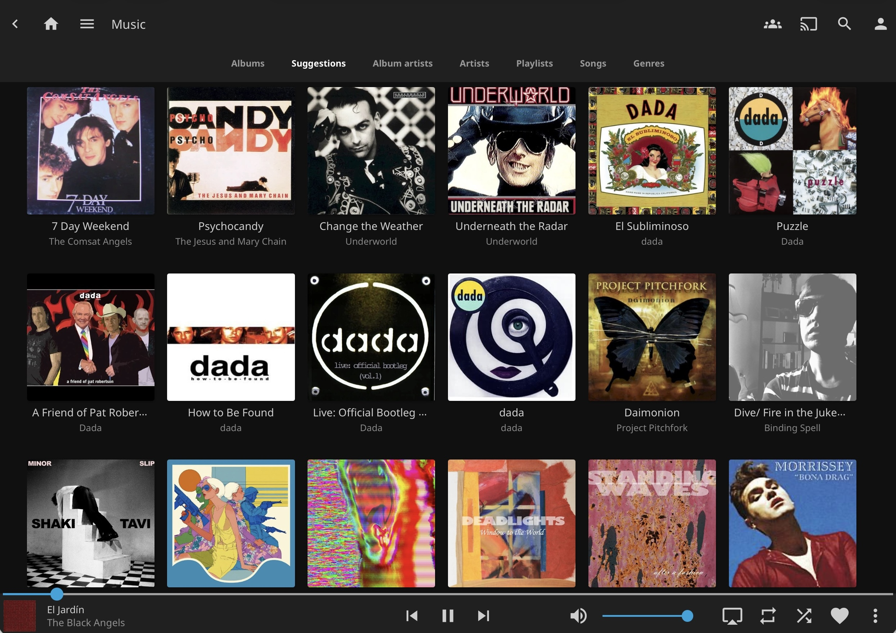
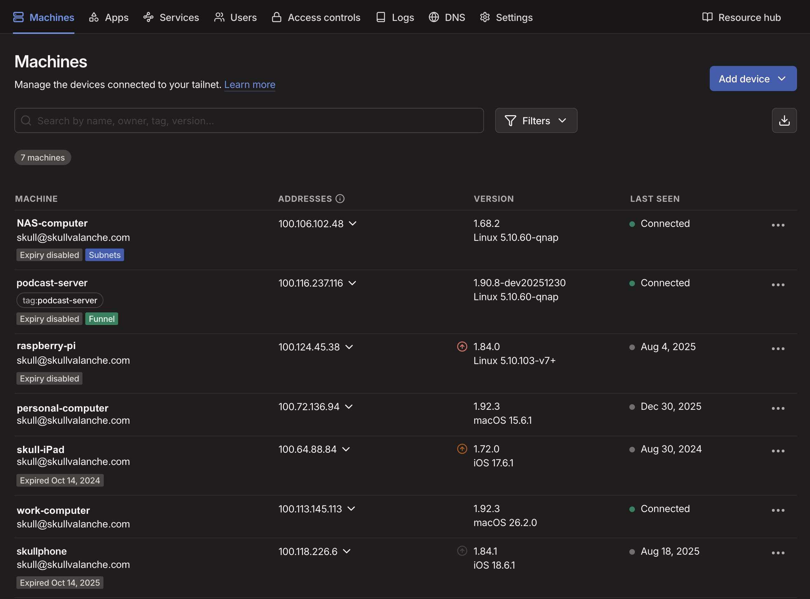

+++
title = "Self Hosting Your Media"
date= 2026-01-07
+++

Years ago I read a very humorous "building a PC for grandma" blog post that has stuck with me over the years, because it was an over-the-top parody of everything that is wrong with hardcore tech nerds writing articles for the general public. By the end of the article, grandma's computer was a dual-boot water-cooled Linux + Windows gaming PC that was absurd overkill for grandma's proposed use case of "getting on the internet".

I promise I will try to never write a tutorial like that. I don't want to make any assumptions about people's tech knowledge, so I try to keep things understandable and explain stuff in plain English.

That said, here goes...

# Why do this at all?

Media files are somewhat unique compared to other files you likely have on your computer. They are unique in that they are typically "read only" -- meaning you don't generally *edit* them, you just *consume* them. The benefit of that is it means they can easily be shifted off your local computer to their own *dedicated* computer with its own dedicated storage drive(s) to avoid filling up your storage on your daily-driver devices.

Now, you *can* upload media files to various "cloud" storage services (Google Drive, Dropbox, OneDrive, Amazon, etc) to get them off your local devices, but depending on how much media you have, paying a regular fee to a data storage service can get quite expensive. Feel free to crunch some numbers and see if that's worth it for your situation. (In which case, feel free to ignore this blog post. 😅)

Speaking for myself, I have far too much media data to be worth paying someone else to store it for me. (It would likely be hundreds of dollars a month.)

Which brings us to the most budget friendly option: **self-hosting** 🎉

Storing media files on a your own hardware (self-hosting) is basically free.

Now, not everyone has a spare computer handy for this, so admittedly there is potentially the one-time cost of obtaining a computer with enough storage to handle being a media storage server, but old computers are generally easy to come by for cheap, and this setup *does not require a particularly fast computer*. The thing to consider most is *storage* -- make sure you have a large enough drive to hold all your media (with room to spare). Also keep in mind this is a one-time cost, once it's up and running, you're only paying for electricity to keep the computer running.

# Okay, let's get started

The basic components of this whole idea are just stitching together 3 technologies:

1. A computer to run as a NAS (Network Attached Storage)
2. The Jellyfin app (free server software to make accessing your media easy)
3. Tailscale (free VPN software to make Jellyfin accessible even when you're away from your home network)

# The NAS computer

If you search for "NAS" on the internet, there's a lot of specialized custom computer hardware out there for running a NAS... and that's great, there's definitely some advantages to having specialized hardware for the purpose, but it's not *necessary*, it's just nice to have. Most of those specialized computers are built around the idea of having critical data resiliency in the event of failures, or having a whole team of people trying to access the data at the same time. If that's your situation, definitely look into those options, but if it's just 1 or 2 people who need to access some music or movies sometimes, a specialized NAS computer is probably overkill.

It's important to configure your NAS computer to never sleep -- it needs to be online at all times or your media won't be accessible.

*Note:* having a backup copy of your data is always a good idea. Hard drives will fail eventually. If it's data you can't replace, always have a backup copy of it. Just remember that your **backup** copy of your media probably doesn't need to be online 24/7.

# Jellyfin

Jellyfin is a free app which runs on Windows, Mac, or Linux computers. There's some initial setup where you tell it which folder(s) contain your media files, then it just runs in the background as a server. 'Server' in this context just means that it makes something available over the network.

Download the it from [Jellyfin.org](https://jellyfin.org) -- be sure to get the version which matches your NAS operating system.

You can follow the official [Jellyfin Quick Start](https://jellyfin.org/docs/general/quick-start/) to install and configure it.

## Boring but kinda important Networking Concepts

I apologize for using the crutch of metaphors, but sometimes they're the best option.

**IP addresses** are sorta like a network "mailing address". When you send network signals (packets) out on to your network, they need to know where to go. IP addresses are part of that but they're more like an address to an apartment building.

**Network ports** are like the individual apartment numbers within that building.

Every computer on a network has an IP address, but since a computer could (potentially) be running multiple "server" apps (services), those apps need to use a specific *port* to ensure they don't interfere with each other.

... That's probably still a bit confusing. Let's try a more specific example.

Once you configure Jellyfin, it's running in the background on your NAS computer. At this point, it should be accessible to other computers on your home network via a web browser. By default, Jellyfin uses port **8096**. (We'll need that port number in a moment.)

Let's pretend the NAS/Jellyfin computer has the IP address `10.0.0.50` (your IP address will be different; get it from your Jellyfin computer's network settings).

Given our example IP, this means on *any other device on your home network* you can point a browser to http://10.0.0.50:8096/ (the IP address + `:` + port number) and play the media files.

Behold! Your own private Spotify on your home network. 🥳

You could stop here, assuming that's good enough for your needs. Maybe you only wanna listen to your media at home.

But what about when *you're not at home*?

*Note:* the "Extra Credit" sections in the quick start guide mention "remote access" but doesn't specifically say Tailscale, so... let's pick up where they leave off.

# Tailscale (a VPN)

First, a quick distinction about VPNs: VPN (Virtual Private Network) is a *technology*, not a product. 

Confusingly, more often than not the term "VPN" has come to mean "a company that provides a very specific use of VPN technology as a service to try to help you stay anonymous". This isn't about that.

VPN the *techology* allows you to connect computers as though they were on the same home (local) network, even when they're not.

Tailscale is a VPN in the *technology* sense, not the "we will try to maintain your privacy" sense.

Historically, setting up a VPN was a technically daunting task, but Tailscale has done a fabulous job of making it so simple anyone can do it.

Tailscale offers a free-for-personal use account. You can sign up for an account at https://login.tailscale.com/start -- they offer a number of different ways to sign up/authenticate.

Once you have created an account you are automatically given a "Tailnet" -- This is your personal virtual network which allows you to communicate with all other devices on your tailnet.

There's a tailscale "client" app which you will need to install on any/all devices you want to be able to communicate on your tailnet.

Once a computer is connected to your tailnet, it gets a tailnet IP address, in addition to its "regular" one. Once you have 1 or more devices connected to your tailnet, you can see their Tailnet IPs in the tailscale admin page. https://tailscale.com/admin

Here's an example of all my devices connected to my tailnet:

At a minimum, you will need to install the tailscale client app on your Jellyfin server machine, and also on your daily-driver computer. Once installed, you simply set it to connect to your tailnet.

Once both your devices are connected to your tailnet, you can access Jellyfin at it's Tailnet IP address.

So, since my NAS has a tailnet IP of 100.106.102.48, I can browse to http://100.106.102.48:8096/ from any computer on my tailnet and it'll bring me to the Jellyfin web interface.

This is kinda a bare minimum primer to getting this stuff all set up. There are definitely further improvements which could be done, if you wanna go further down the rabbit hole.

- For instance, instead of having to use IP addresses, you could use [Tailscale MagicDNS](https://tailscale.com/kb/1081/magicdns)
- Install some [Jellyfin client apps](https://jellyfin.org/downloads/clients/), instead of just using the web interface
