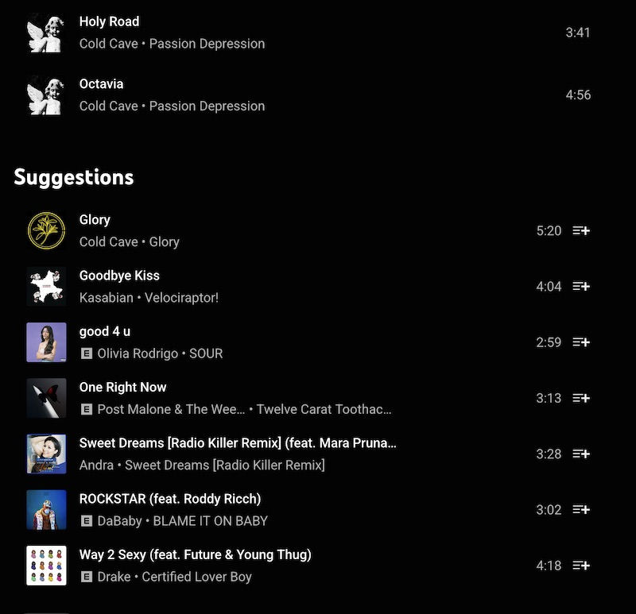
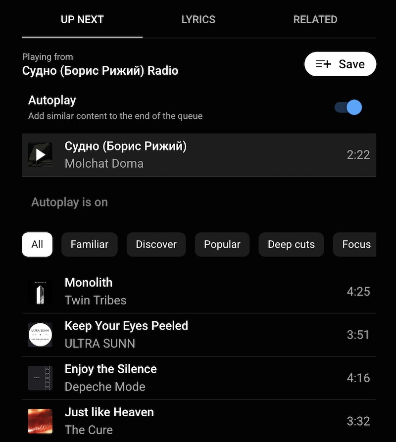

+++
title = "SRSLY Youtube Music, WTF"
date= 2025-01-11
+++

Things to know ahead of time: I listen to a lot of "off the beaten path" music genres. I also spend a lot of time looking for _new_ music. I am reasonably certain this is reflected in my YTM library/playlists/usage patterns. All of which are things I would expect Youtube engineers to factor into their product.

I rant about how bad the Youtube Music "suggestions" algorithm is frequently. I hate it, and yet I keep using YT Music in spite of everything.

At some point I need to just realize the blame is mine. This is me failing to just go use a different platform. But first, I will take this opportunity to rant yet again about how bad their suggestion algo is. Never let a complaint opportunity go to waste.

Let's examine some evidence. Here's a lovely screenshot of the algo taking a playlist consisting (mostly) of Post-Punk, Post Rock, and Shoegaze artists... what do they suggest I add?

The top suggestion? More Cold Cave. Okay, that's a bit on-the-nose, but considering the playlist has an entire Cold Cave album in it, sure.

Next suggestion is equally on-the-nose, since there is also Kasabian in the playlist. Okay fine.

Then **Olivia Rodrigo** ? Go home, YTM, you're drunk.

The suggestions algo seems to throw up its hands after 2 simplistic suggestions and just default to "well, these songs are popular, generally speaking".

I would expect more from a company that is literally trying to lead the way on putting AI in every damn thing.

Alright, let's try something else. I'll queue up 1 relatively obscure song by the Belarussian band Molchat Doma and see what the autoplay queues up for me.

Twin Tribes? ULTRA SUNN? okay, so far so good...

Enjoy the Silence? ENJOY THE GODDAMN SILENCE? You think I put in Molchat fucking Doma only to be steered to a song that spent 3 weeks in the Top 10? 🤦‍♂️

Hmm, maybe it was just a one-off... oh, nope, The Cure. Of course. Another Top 40 hit by a band pretty much everyone and their mom has heard of.

Okay, if I'm being generous, the _only_ explanation for this kind of suggestion algorithm is if it's built around the idea "oh, maybe you might like some of the bands which were influences on the band you're currently listening to". I would expect better from a Google product though. Surely they have enough behavior data on me to know better than that.

Do better, Youtube Music.
